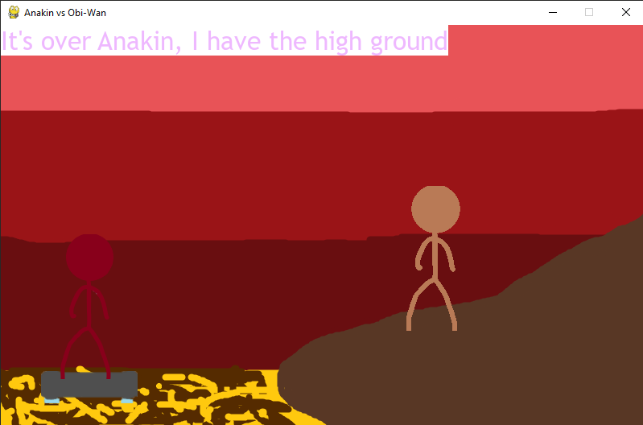
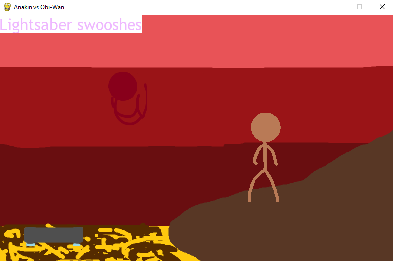
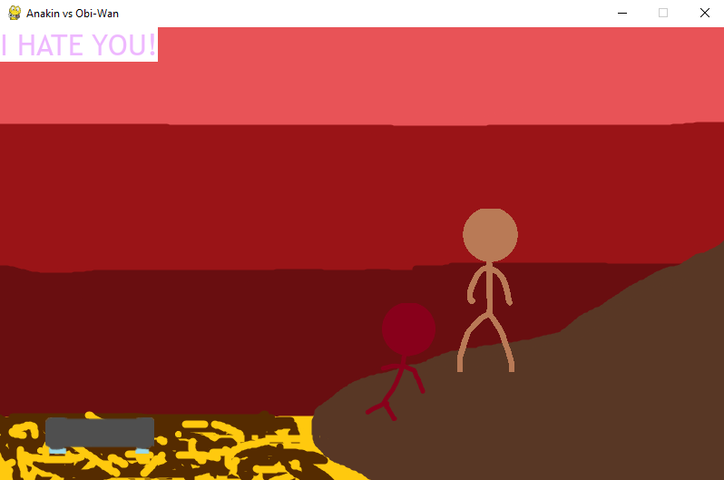

# Description
An animation with audio and subtitles from a movie scene (Star Wars: Episode III - Revenge of the Sith), made using the Pygame package.

## How to run the code
Install the following packages using pip
>$ pip install pygame

### Screenshots

